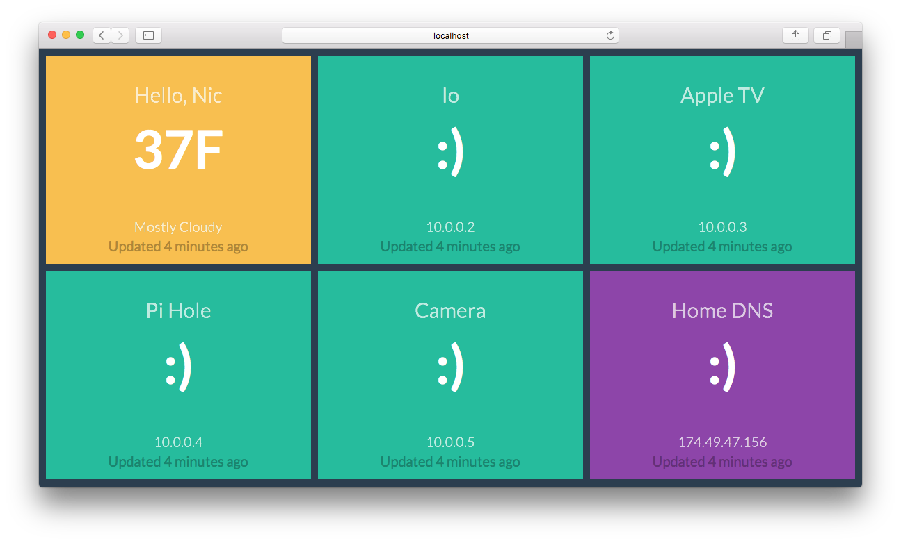

# glances

A heads-up dashboard for displaying thing-statuses overhead.



## Overview

Glances is made up of Blocks and works primarily over websockets. Add your own blocks in `blocks/`.

## Block Anatomy

A block may be either a function or an object and include the following keys:

* title
* value
* moreInfo
* color
* position

Example:

```javascript
module.exports = function(emit) {
  every('5 minutes', function () {
    emit({
      name: 'Test',
      value: isUp() ? '✓' : ':(', // `isUp` is a hypothetical function
      color: isUp() ? 'green' : 'red'
    })
  })

  return {
    name: 'Test'
  }
}
```
